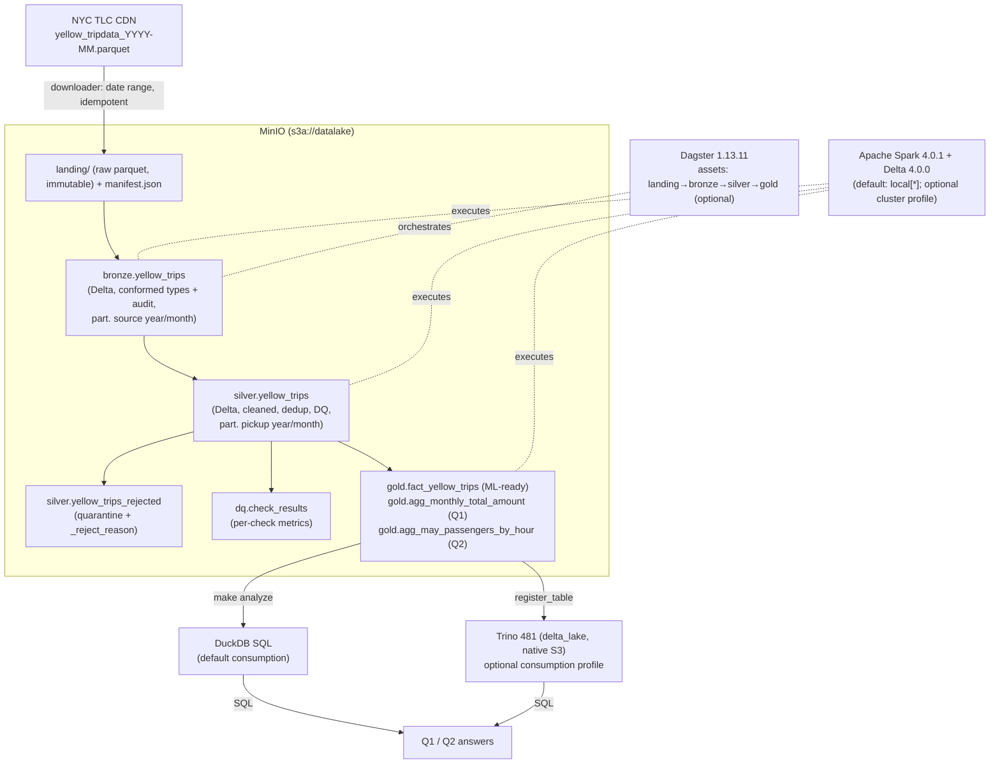

# Architecture

## Pipeline (medallion) and components

## Data model

**Bronze** — `bronze.yellow_trips` (Delta, partitioned by `source_year`, `source_month`)

| column | type | notes |
|---|---|---|
| VendorID | int | canonical cast |
| passenger_count | double | drift-proof cast (INT64↔DOUBLE across files) |
| total_amount | double | |
| tpep_pickup_datetime / tpep_dropoff_datetime | timestamp | |
| trip_distance | double | kept for EDA |
| _source_file, _source_month, source_year, source_month, _batch_id, _ingested_at | — | provenance/partition |

**Silver** — `silver.yellow_trips` (Delta, partitioned by `pickup_year`, `pickup_month`): the
Bronze columns of interest plus `pickup_year_month`, `pickup_hour`, `pickup_date`; only rows
passing the DQ gate. Rejected rows go to `silver.yellow_trips_rejected` with `_reject_reason`.

**Gold**
- `fact_yellow_trips` — analytics/ML-ready trip fact (required columns + time dimensions).
- `agg_monthly_total_amount` — **Q1**: `pickup_year_month, trips, avg_total_amount`.
- `agg_may_passengers_by_hour` — **Q2**: `pickup_hour, trips, avg_passenger_count`.

## Why this shape
- Landing keeps raw fidelity; Bronze conforms types (drift) and records provenance; Silver is
  the trust boundary (cleaning + quarantine + metrics); Gold is consumer-facing.
- Answers are served by **DuckDB SQL over Gold** (lightweight, always works); Trino is an
  equivalent, decoupled SQL path (optional). The same design maps to serverless AWS
  (EMR Serverless + Athena) — see [aws-reference-architecture.md](aws-reference-architecture.md).
  See the ADRs in [`docs/adr`](adr) for every decision.
