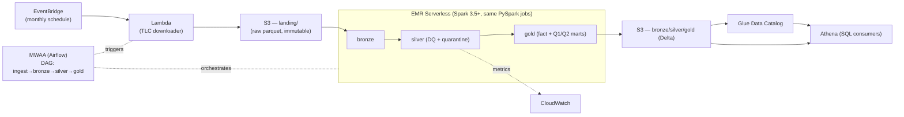

# AWS reference architecture (production target)

This project runs **locally** for reproducibility, cost and testability. This document shows how
the **same code** maps to a serverless AWS lakehouse — the scale/production story behind the
local single-node default. It is a **reference design (not deployed)**; the local stack is the
runnable artifact.

## Local → AWS mapping (1:1)

| Layer | Local (this repo) | AWS (production) |
|---|---|---|
| Lake / object store | MinIO (`s3a://datalake`) | **Amazon S3** (`s3a://`/`s3://`) |
| Ingestion | `src/ingestion/downloader.py` | **AWS Lambda** triggered by **EventBridge** (monthly schedule) → S3 landing |
| Compute (PySpark) | Spark `local[*]` (1 container) | **Amazon EMR Serverless** (Spark) — same PySpark jobs via a Spark-submit job driver |
| Table format | Delta Lake on MinIO | **Delta Lake on S3** |
| Metadata / catalog | Delta transaction log | **AWS Glue Data Catalog** |
| SQL consumption | DuckDB (Spark SQL also available) | **Amazon Athena** (serverless SQL over Delta via Glue Catalog) |
| Orchestration | Makefile (sequential targets) | **Amazon MWAA** (Managed Airflow) |
| Data quality | `dq.check_results` Delta + logs | same `dq.check_results` table + **CloudWatch** metrics/alarms |
| Provisioning | docker-compose | **Terraform / CDK** (skeleton TBD) |
| Credentials | static keys (MinIO) | **IAM roles** (no secrets in code) |
| Cost @ this scale | local only | a few **cents/run** (pay-per-use) |

## Diagram

## What actually changes in the code (config only)

Because everything is centralized in `src/config.py` / `src/common/spark.py`, the move is a
**configuration swap, not a rewrite**:

| Setting | Local | AWS |
|---|---|---|
| `fs.s3a.endpoint` / `MINIO_ENDPOINT` | `http://minio:9000` | unset (real S3 regional endpoint) |
| `fs.s3a.path.style.access` | `true` (MinIO) | `false` (S3 virtual-hosted) |
| `fs.s3a.aws.credentials.provider` | `SimpleAWSCredentialsProvider` (static keys) | default chain → **IAM role** (no keys) |
| `SPARK_MASTER` | `local[*]` | managed by EMR Serverless |
| Catalog | Delta transaction log | `spark.sql.catalogImplementation=hive` + **Glue Catalog** |

The PySpark transforms (`bronze.py`, `silver.py`, `gold.py`), the Delta tables, the DQ engine
and the Q1/Q2 logic are **unchanged**.

## Why EMR Serverless for compute

- **Code parity:** the same PySpark entrypoints run via a Spark-submit job driver
  (`StartJobRun`: `entryPoint=s3://.../bronze.py` + `sparkSubmitParameters` for `--conf`/`--jars`)
  — full Spark-conf control, no rewrite into a framework-specific API.
- **Version control:** we pick the EMR release and Spark config, preserving the "same code,
  pick the version" portability story.
- **Right-sizing:** pay per vCPU/GB-second with no cluster to manage — fits an intermittent
  monthly pull far better than a permanent cluster.

## Cost model (this dataset: ~16M rows / 250 MB, monthly)

- **Athena:** ~US$5 per TB scanned → the Q1/Q2 marts are <1 GB → **~US$0.001/query**.
- **EMR Serverless:** billed per vCPU/GB-second; a job at this size = a few vCPU-minutes → **cents**.
- **S3 / Lambda / EventBridge:** negligible at this volume.
- Net: a production run costs **pennies**, and there is **no idle cost** (nothing always-on).

## Out of scope here (intentional)
Deployment is not automated in this repo (no live AWS). A Terraform/CDK skeleton
(S3 + EMR Serverless application + Glue Catalog + Athena workgroup + EventBridge + MWAA) is a
planned follow-up; the local stack remains the runnable deliverable.
